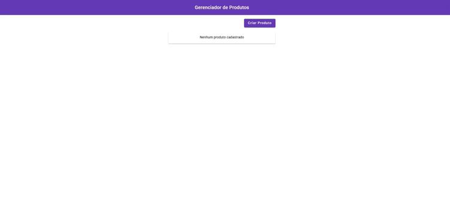

<h1 align="center">ProductStore</h1>
<br>



> Projeto realizado durante o curso de atualização do Angular 17 da Code Dimension, disponibilizado gratuitamente pelo canal no Youtube.

### 🛠️ Tecnologias

**Angular 17** • Framework front-end para construção de SPAs.

**TypeScript 5.4** • Superset do JavaScript com tipagem estática.

**Angular Material** • Biblioteca de componentes UI baseada no Material Design.

**RxJS** • Biblioteca para programação reativa com Observables.

**JSON Server** • API fake para simulação de backend durante o desenvolvimento.

## 🚀 Rodando o ProductStore

### 💻 Pré-requisitos

Antes de começar, verifique se você atendeu aos seguintes requisitos:

- Você instalou a versão mais recente do `Node.js`
- Você instalou um gerenciador de pacotes: `npm` ou `yarn`.
- Você instalou o `Angular CLI`.

### 📦 Instalando as Dependências

```bash
# Clone o repositório:
$ git clone https://github.com/gabrielimoreira/angular_17.git

# Acesse a pasta do projeto:
$ cd product-store

# Instale as dependências:
$ npm install | yarn install
```

### ☕ Usando ProductStore

Para usar <ProductStore>, inicie o projeto com:

```
npm start | yarn start
```

> Isso iniciará o servidor de desenvolvimento do Angular. Normalmente, a aplicação estará disponível em: ➡️ http://localhost:4200/

### 💾 API Fake com JSON Server

Se o projeto depende de um backend fake, você pode iniciar o JSON Server com:

```
npm run json-server
```

> Isso iniciará uma API local disponível em http://localhost:3000 (caso o json-server esteja configurado no package.json).
